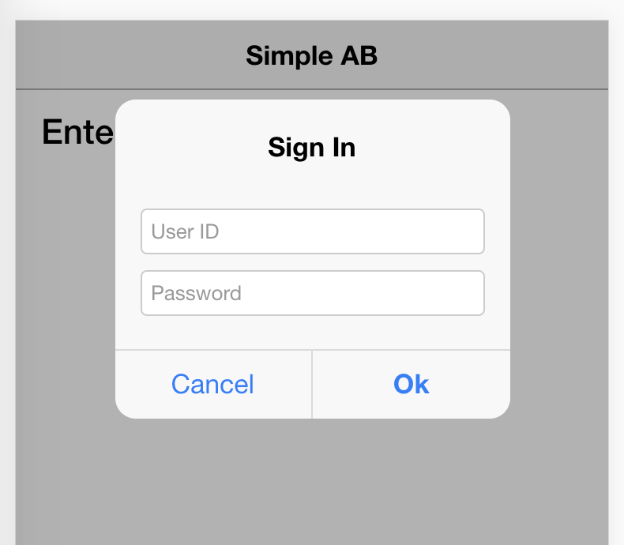

[Table of contents](../readme.md)

## Get the Address Book
We ended the [get started](get-started.md) exercise with a working app that validates the AIS url and displays its version.  
Now we can move on to our Address Book.

#### Get the e1-helper
We've imported the E1 Service Module as a contained library that provides us with the AIS service calls that we need.  We don't need to know the details of how the calls are made or need to customise their behavior.  We only need the call signatures for the implementations.  
When it comes to the implementation we however want the actual code -- but also don't want to have to rewrite the same logic again and again.  
This might be a shock to purists, but the plain copy-and-paste is a very efficient way of re-using code.  [GitHub](https://github.com) has what they call Gist for the purpose of sharing commonly used code-snippets.  My Gist has what I call [e1-helper](https://gist.github.com/Herdubreid/e7609368ac889103c8a74309d09c7be7) functions that encapsulate the authentication into a form request.  
The justification for these functions is that a mobile app can be in on of three authenticated states:

    1. Not Authenticated yet (no AIS token)
    2. Authentication expired (AIS token expired)
    3. Authenticated (AIS token valid)

The e1-helper functions save us from having to test the authenticate state every time we make a form request.  So lets add it to our app.  
Create a new folder under `src` and name it `e1` (this is where we put our e1 related code).  And under `src/e1` create new file named `e1-helper.ts` and copy-and-paste the e1-helper gist into it.
To make the `e1-helper` available to our app, open the `app.module.ts` and make the following changes:

```javascript
import { E1HelperService } from '../e1/e1-helper';  // <--- New import

  providers: [
    { provide: ErrorHandler, useClass: IonicErrorHandler },
    E1HelperService  // <--- Our E1HelperService
  ]
```

#### Create the AB request
The E1 application we want to use is 'A/B Word Search' (P01BDWRD).  Create a new file in `src/e1` for the request and call it `ab-word-search.ts` (remember `kebab case` for files, just to confuse everyone, ionic uses `.` for files).  
And add the following code:

```javascript
import { FormRequest } from 'e1-service';

export class AbWordSearchRequest extends FormRequest {
    constructor(search: string) {
        super();
        this.formName = 'P01BDWRD_W01BDWRDA';
        this.formServiceAction = 'R';
        this.formActions = [
            {
                controlID: '18',
                command: 'SetControlValue',
                value: search
            },
            {
                controlID: 15,
                command: 'DoAction'
            }
        ];
    }
}
```

The `AbWordSearchRequest` class encapsulates the information needed for the request.  We pass it a search word string which gets passed to `controlID` 18 and press the find button which is `controlID` 15.

#### Make the call
We are now ready to create our request for AIS.  
Open up the `home.ts` file and make the following changes:

```javascript
import { Component } from '@angular/core';
import { Store } from '@ngrx/store';
import { SignonService, FormService, IServerState } from 'e1-service';  // <--- Add FormService
import { E1HelperService } from '../../e1/e1-helper';  // <--- Import the e1-helper
import { AbWordSearchRequest } from '../../e1/ab-word-search'; // <--- Import our A/B Word Search Request¸

@Component({
  selector: 'page-home',
  templateUrl: 'home.html'
})
export class HomePage {
  aisVersion: any;
  constructor(
    store: Store<{ server: IServerState }>,
    signon: SignonService,
    form: FormService,  // <--- Inject the FormService
    e1: E1HelperService  // <--- Inject the e1-helper
  ) {
    this.aisVersion = store.select<string>('server', 'defaultconfig', 'aisVersion');
    signon.testUrl(
      'https://jde02.uxcredrock.com/mobile/',
      {
        success: () => {
          console.log('Valid Url!');
          form.request = new AbWordSearchRequest('peter');  // <--- 1st, request to look for peter
          e1.call(form);  // <--- 2nd, make the request with the e1-helper
        },
        error: (msg) => {
          console.log('Error in Url:', msg);
        }
      });
  }
}
````

We make our request inside the `success` return so that it only gets called once the url has been validated.  First we create an instance of our 'A/B Word Search' with 'peter' as the search word and then we use the `e1-helper` to make the request with the `e1.call(form)` function.  
Once this has been saved and re-build, our app should prompt you for credentials.  


#### Review the response
As before with our defaultconfig call, we haven't looked at the response yet.  So lets look at the Redux Store with the `Redux DevTools` extension.  
  
The `server` now has a new element called `formResponse` and if we drill down to the `rowset` member we can see that 'peter' returned 3 rows which we want our app to display.

#### De-structure the response
The response is in what's called JSON format.  To work with it in our code we can define an Interface for it with the information we are interested in.  
Open the `src/e1/ab-word-search.ts` file and add the following code:

```javascript
import { FormRequest, IFormResponse, IForm, IFormData, IRow, IValue } from 'e1-service';

export interface IAbWordSearchRow extends IRow {
    mnAddressNumber_21: IValue;
    sAlphaName_50: IValue;
    sPrefix_29: IValue;
    sPhoneNumber_30: IValue;
    sAddressLine1_31: IValue;
    sCity_32: IValue;
}

export interface IAbWordSearchResponse extends IFormResponse {
    fs_P01BDWRD_W01BDWRDA: IForm<IFormData<IAbWordSearchRow>>
}
```

We add few imports from the e1-service and then define two interfaces, one for the grid row data with a definition for the fields we are interested in and another with a definition for form.  
We can now use this in our app, so in `home.ts` add the following code:

```javascript
import { AbWordSearchRequest, IAbWordSearchResponse } from '../../e1/ab-word-search'; // ---> import the response interface

@Component({
  selector: 'page-home',
  templateUrl: 'home.html'
})
export class HomePage {
  aisVersion: any;
  abWordSearchResponse: IAbWordSearchResponse;  // --> Add it as member variable
  constructor(
    store: Store<{ server: IServerState }>,
    signon: SignonService,
    form: FormService,
    e1: E1HelperService
  ) {
    this.aisVersion = store.select<string>('server', 'defaultconfig', 'aisVersion');
    store.select<IAbWordSearchResponse>('server', 'formResponse')
      .subscribe(response => this.abWordSearchResponse = response);  // ---> Assign the response to our member variable
````

Since we are only going to display the response values, we could make it `Observable` like the `aisVersion`, but the purpose here is to show how we can also extract the response as variable that we could use in our code.  
The `subscribe` method is similar to the `| async` in that it sets our `abWordSearchResponse` whenever it changes.  
Now open the `home.html` file and add the following code:

```html
<ion-content padding>
  <h3>{{ aisVersion | async }}</h3>
  <h4>{{ abWordSearchResponse?.fs_P01BDWRD_W01BDWRDA.title }}</h4>
  <ion-list>
    <ion-item *ngFor="let row of abWordSearchResponse?.fs_P01BDWRD_W01BDWRDA.data.gridData.rowset">
      <ion-label>
        {{ row.mnAddressNumber_21.value }}
      </ion-label>
      <div item-content>
        {{ row.sAlphaName_50.value }}
      </div>
    </ion-item>
  </ion-list>
</ion-content>
```

We start by showing the title of the E1 app.  Compared to the syntax for the `aisVersion` we don't need the `| async` parameter and the `?` after `abWordSearchResponse` indicates that the parameter that follows might not be there (it doesn't get assigned until after the form request call returns).  
The `<ion-list>, <ion-item> and <ion-label>` are display tags provided the Ionic framework and the `let row of abWordSearchResponse...` code iterates through the rowset parameter of the response and creates `<ion-item>` for each with the address number and alpha name values.  
Our app should now return the following result:  
  
The last thing needed to make the app useful, is to let the search string be a user input.

[Next - Interactive Search](interactive-search.md)