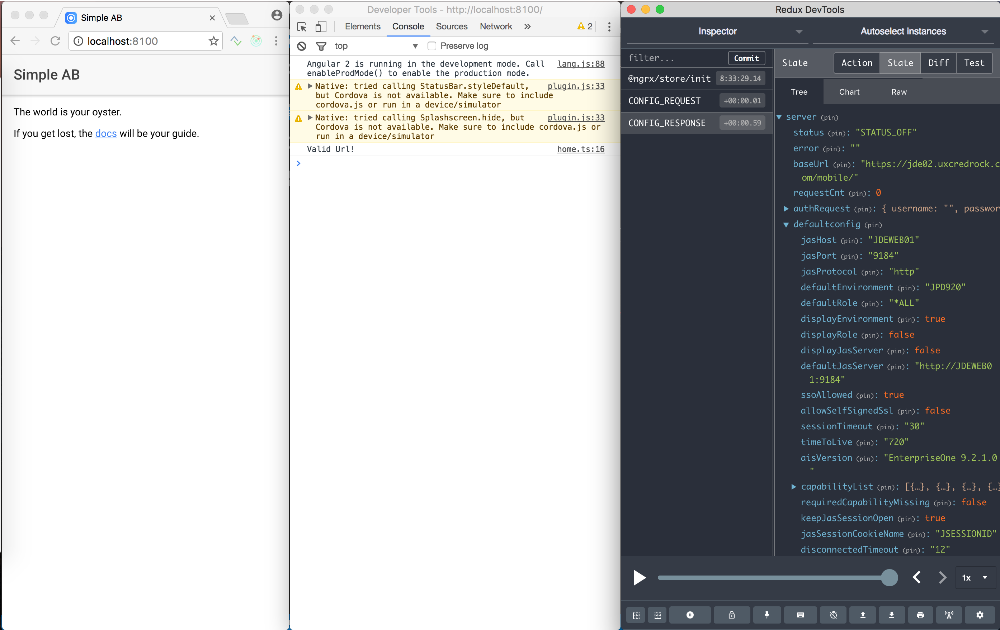

## An example e1-service application
So how to you build an E1 mobile app, I hear the crowd crying!  
Lets then create an app for simple Address Book lookup.

### Prerequisite
First, have the latest recommended versions of [Node](https://nodejs.org), [git](https://git-scm.com) and [Visual Studio Code](https://code.visualstudio.com/download) installed  (git is not technically required -- but you'll need it sooner rather than later).

Next, install [ionic](http://ionicframework.com/getting-started/) with

```bash
$ npm install -g cordova ionic
```

#### Terminal vs. Command Prompt
`$` is the terminal prompt for iOS and Linux, opposite Window's `>` command prompt.  
The convention appears to prefer `$` in documentation, which I'll follow.  So whenever you see the `$` prefix, that means running from the terminal or command prompt (or PowerShell).  
And unless specified, run from inside the project directory (`<projects>/simple-ab`).  

### Create project
From your projects folder, create the SimpleAB project with:

```bash
$ ionic start -v -a 'SimpleAB' -i io.celin.simpleab simple-ab blank
```

The `io.celin.simpleab` is a unique identifier needed by >>Google Play<<.  The naming convention is a reverse url and in this case celin.io identifies the app's domain.  
Feel free to change it to domain of choice.

#### Naming convention
The above `ionic` statement has three different naming conventions which might appear confusing.  
The `.` convention of the app id should be familiar but why the `camel case` (new word identified with upper case, like in `SimpleAB`) versus the `kebab case` (a `-` separates words like in `simple-ab`)?  
There is probably a long-winding paper about this somewhere on the Internet, but I like to think of the `kebab case` as the preferred system naming convention (files, directories etc.) but `camel case` inside files.  
Logically this should really be the other way around with `camels` turned into `kebabs` inside the files.  But there is something visually wrong about class or variables names with dashes.

## Open the project
Once the `ionic start` script has completed, start Visual Code and open the `simple-ab` folder.  
A number of folders and files have been created, the the most important being the `src` folder where the source code is.  
The `blank` parameter of the `ionic start` script created a no-frills application with its single page under `src/pages/home`.  The page has three files:

  * `home.html` : The visual part or template component
  * `home.scss` : The styling of the template
  * `home.ts` : The logic, or functional component

To see how this works, type:

```bash
$ ionic serve
```

This script will compile the app and then run it in your default browser.  
Now open the `home.html` template and replace `Ionic Blank` with `Simple AB`.  The script is set to monitor the source files so when you save your change it will re-compile and refresh the app.

#### Browsers
You can run the app in any modern browser but for debugging purpose, I recommend Google Chrome with `Redux DevTools` extension (comes in handy later).

## Add the E1 Service Module
The e1-service module uses what's called [Redux](http://redux.js.org).  To install it, type:

```bash
$ npm install @ngrx/core @ngrx/store @ngrx/store-devtools --save
```

Next, get the E1 Service Module with:  

```bash
$ npm install e1-service --save
```

This makes the E1 Service Module available in your project.  To tell the app to load it, open `src/app/modules.ts` and add the following import definitions:

```javascript
import { StoreModule } from '@ngrx/store';
import { StoreDevtoolsModule } from '@ngrx/store-devtools';
import { E1ServiceModule, serverAction, initialServerState } from 'e1-service';
```

And add the modules to the imports section:

```javascript
  imports: [
    IonicModule.forRoot(MyApp)
    E1ServiceModule,
    StoreModule.provideStore({ server: serverAction }, { server: initialServerState }),
    StoreDevtoolsModule.instrumentOnlyWithExtension()
  ],
```

The E1 Service Module is now ready to be used by the app's components.

## Verify AIS availability
Before calling the Address Book, it's a good idea to validate the Url we've been given.  
So what we want to do is to call the `defaultconfig` service and display the AIS version number.  
Open the `src/home/home.ts` file and changes its content to:

```javascript
import { Component } from '@angular/core';
import { SignonService } from 'e1-service';

@Component({
  selector: 'page-home',
  templateUrl: 'home.html'
})
export class HomePage {
  constructor(
    signon: SignonService
  ) {
    signon.testUrl('https://jde02.uxcredrock.com/mobile/');
  }
}
```
What we have done here is 'injected' the `SignonService` class into our `HomePage` class. This is equivalent to making it a member of the class with `signon` as the name.  We then simply call the `testUrl` function with our AIS url as parameter.  
So where is the result of the call?  Traditional function calls return something that we can evaluate, a boolean for example is the logical return of a test function.  
The thing to keep in mind here is that our app is single-threaded. If `testUrl` would return with a true or false result for example, it would need to hang onto the thread until it has completed the call to AIS and evaluated the response.  In the meantime the app is unresponsive, giving the impression of poor performance or even having crashed.  
The solution is using what I like to call:

 >the agent - don't call us, we'll call you

The programming term is >>callbacks<<, where a function to call is a parameter to a function.  
The signature of the `testUrl` function is:

```javascript
testUrl(baseUrl: string, callback?: IServiceCallback): void;
```

The `?` following the callback parameter means that it is optional.  The `IServiceCallback` interface has the following definition:

```javascript
export interface IServiceCallback {
    success?: any;
    error?: any;
    done?: any;
}
```
The `success`, `error` and `done` members are functions to call upon successful or error function result and when the function is done executing.  If we want to know if our `testUrl` succeeded or failed, we can change the call to:

```javascript
signon.testUrl(
    'https://jde02.uxcredrock.com/mobile/',
    {
        success: () => {
            console.log('Valid Url!');
        },
        error: (msg) => {
            console.log('Error in Url:', msg);
        }
    });
```
This may look odd to someone not familiar with JavaScript, it has certainly taken me some time to get used to this syntax.  But what's happened here is that the second parameter is a class with the member functions `success()` and `error(msg: any)`.  
The `console.log` function prints its message on the Console of the browser's 'Developer Tools' (in Chrome, right-click the window content and select 'Inspect').  

#### Fetching data from Redux
The addition of the callback gives use the ability to build logic based on whether the call was successful or failed.  But we also need the returned config of the call so we can display the AIS version.  This is where Redux comes into play.  
For this, you need Chrome with the `Redux DevTools` extension.  If you open up the `Redux DevTools` and display on the right, with the Inspect Console in the middle, your screen should look something like this.  
  
If you recall the definition of the Redux Store earlier:

```javascript
    StoreModule.provideStore({ server: serverAction }, { server: initialServerState }),
```

You can see that our `State` has a `server` member and below it is `defaultconfig` with the result from our `testUrl` call.  The `defaulconfig` has a member called `aisVersion`, which is the value that we want to display in our app.  
Make the following changes to our `home.ts` file:

```javascript
import { Component } from '@angular/core';
import { Store } from '@ngrx/store'; // <--- Add
import { SignonService, IServerState } from 'e1-service';

@Component({
  selector: 'page-home',
  templateUrl: 'home.html'
})
export class HomePage {
  aisVersion: any;  // <--- Add
  constructor(
    store: Store<{ server: IServerState }>, // <--- Add
    signon: SignonService
  ) {
    this.aisVersion = store.select<string>('server', 'defaultconfig', 'aisVersion'); // <--- Add
```

And change the `ion-content` of our `home.html` file to the following:

```html
<ion-content padding>
  <h3>{{ aisVersion | async }}</h3>
</ion-content>
```

Once the app has re-loaded, it should now show the AIS version we've been given.  
What we've done here is injected the Redux Store into our class and used its `select` method to read the `aisVersion` member into our `aisVersion` variable. The `aisVersion` value is then displayed on our `home.html` page with the `{{ aisVersion | async }}`.  
The important thing to pay attention here is that the `aisVersion` variable is of type `any`, not `string` as you might have expected.  And the `| asyn` syntax used when it's referenced on the `home.html` page.  Variable type `any` just means that it can take any form so when it's assigned by the `store.select` statement it takes the form of `Observable`.  It can be thought of as a variable that notifies its users when it changes -- hence the `| async` syntax.