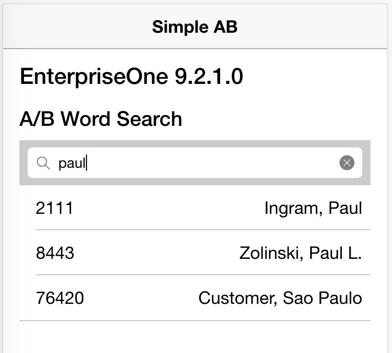

## Add the search as user input
We ended the [call address book](call-addressbok.md) with a call to the 'A/B Word Search' form for 'peter' and displayed the result.  
To make the app useful we need to make it interactive by letting the user type in the search word.

#### Add the search box
Search is such a common feature so Ionic have a standard search box that we can add to our `home.html` page:

```html
<ion-content padding>
  <h3>{{ aisVersion | async }}</h3>
  <h4>{{ abWordSearchResponse?.fs_P01BDWRD_W01BDWRDA.title }}</h4>
  <ion-searchbar *ngIf="aisVersion | async" (ionInput)="search($event)" placeholder="A/B Word Search"></ion-searchbar>
```

Because we want to call e1 as a response to text being entered into the text box, we need something to prevent calls unless a valid url has been entered.  One way of doing it to use the `*ngIf` directive which doesn't show the element unless the right hand evaluates to true.  In the above example the `aisVersion` remains `undefined` until the defaultconfig request has successfully returned, and evaluates to `false`. Once the defaultconfig has value it will evaluate to `true` and the search box becomes visible.  
We also need to add the `search($event)` function to our class, so open `home.ts` and make the following changes:

```typescript
export class HomePage {
  aisVersion: any;
  abWordSearchResponse: IAbWordSearchResponse;
  search(searchEvent) {  // <--- new function
    if (searchEvent.target.value && searchEvent.target.value.trim().length > 2) {
      let search = new AbWordSearchRequest(searchEvent.target.value.trim() + '*');
      this.form.request = search;
      this.e1.call(this.form);
    }
  }
  constructor(
    store: Store<{ server: IServerState }>,
    signon: SignonService,
    public form: FormService,  // <--- make form public
    public e1: E1HelperService  // <--- make e1 public
  ) {
    this.aisVersion = store.select<string>('server', 'defaultconfig', 'aisVersion');
    store.select<IAbWordSearchResponse>('server', 'formResponse')
      .subscribe(response => this.abWordSearchResponse = response);
    signon.testUrl(
      'https://jde02.uxcredrock.com/mobile/',
      {
        success: () => {
          console.log('Valid Url!');  // <--- remove the form call from here
        },
        error: (msg) => {
          console.log('Error in Url:', msg);
        }
      });
```

Because we are calling `form` and `e1` from a member function of our class, we need to prefix it with `public` so it becomes available from the context variable `this`.  
The search function waits until at least 3 characters have been entered in the search box and then appends it with `*` and makes the form request.  
The result is displayed using the same logic as before.  

The final piece is to get this onto a mobile device.

